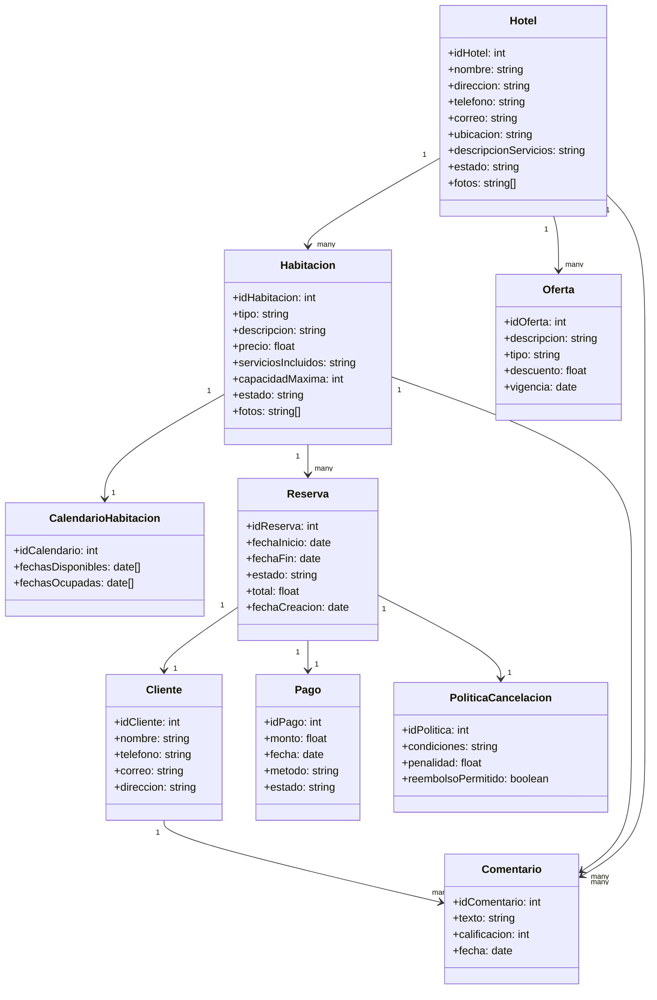

## 📌 Entidades identificadas

1. **Hotel**

   * idHotel, nombre, dirección, teléfono, correo, ubicación, descripciónServicios, estado, fotos

2. **Habitación**

   * idHabitación, tipo, descripción, precio, serviciosIncluidos, capacidadMáxima, estado, fotos

3. **CalendarioHabitación**

   * idCalendario, fechasDisponibles, fechasOcupadas

4. **Oferta**

   * idOferta, descripción, tipo, descuento, vigencia

5. **Reserva**

   * idReserva, fechaInicio, fechaFin, estado, total, fechaCreación

6. **Cliente**

   * idCliente, nombre, teléfono, correo, dirección

7. **Pago**

   * idPago, monto, fecha, método, estado

8. **PolíticaCancelación**

   * idPolítica, condiciones, penalidad, reembolsoPermitido

9. **Comentario**

   * idComentario, texto, calificación, fecha

---

## 📊 Relaciones principales

* Un **Hotel** tiene muchas **Habitaciones**.
* Un **Hotel** puede tener muchas **Ofertas**.
* Una **Habitación** pertenece a un **Hotel**.
* Una **Habitación** tiene un **CalendarioHabitación**.
* Una **Habitación** puede estar asociada a muchas **Reservas**.
* Una **Reserva** pertenece a un **Cliente** y a una **Habitación**.
* Una **Reserva** genera un **Pago** y puede estar sujeta a una **PolíticaCancelación**.
* Un **Cliente** puede hacer muchas **Reservas**.
* Un **Cliente** puede dejar muchos **Comentarios** asociados a una **Habitación** o un **Hotel**.

---

## 🎨 Diagrama de clases en Mermaid

